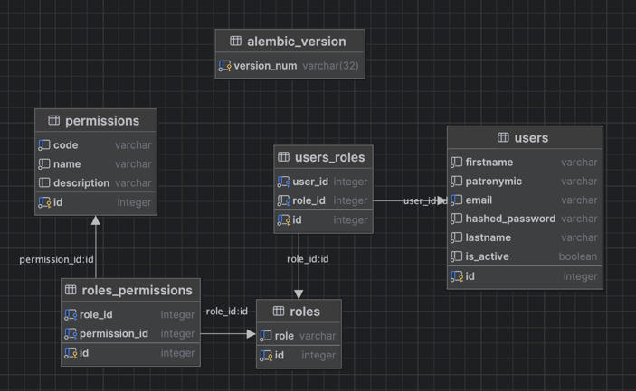

# Auth Service

Backend-приложение на `FastAPI` с JWT-аутентификацией, ролями и системой разрешений (`RBAC`).

## Запуск

Запуск всего приложения одной командой:

```bash
docker compose up --build
```

После запуска:

- API: `http://localhost:8000`
- Swagger UI: `http://localhost:8000/docs`
- Postgres: `localhost:6432`

При старте backend-контейнер:

1. применяет миграции `alembic upgrade head`
2. заполняет БД тестовыми данными
3. запускает `uvicorn`

## Пример .env

```env
DB_USER=postgres
DB_PASS=root
DB_HOST=localhost
DB_PORT=6432
DB_NAME=auth

JWT_SECRET_KEY=1Y[v8qga8)99_9;PSx9a)|u8dy;uuO-,uC2qEcId{7v
JWT_ALGORITHM=HS256
ACCESS_TOKEN_EXPIRE_MINUTES=5
REFRESH_TOKEN_EXPIRE_HOURS=12
```

## Тестовые пользователи

Скрипт сидов автоматически создаёт 3 аккаунта:

- `admin@example.com` / `Admin123!`
- `manager@example.com` / `Manager123!`
- `user@example.com` / `User123!`

## Роли и разрешения

В проекте используется схема `RBAC`:

- у пользователя одна роль
- у роли может быть много разрешений
- доступ к защищённым ручкам проверяется через `require_permission(...)`

Роли:

- `ADMIN`  
  Имеет доступ ко всем ручкам. Для `ADMIN` в коде есть bypass: если роль пользователя `ADMIN`, проверка permissions пропускается.
- `MANAGER`  
  Имеет доступ ко всем не-админским возможностям проекта. В текущем состоянии это аутентификация, пользовательские ручки и полное управление товарами.
- `USER`  
  Имеет доступ к разделам аутентификации, своим пользовательским ручкам, просмотру товаров и управлением карзины с товарами.
- `GUEST`  
  Имеет доступ только к просмотру товаров.

## Как устроена БД

Основные таблицы:

- `users`  
  Пользователи: ФИО, email, hash пароля, `is_active`
- `roles`  
  Роли пользователей: `ADMIN`, `MANAGER`, `USER` и др.
- `permissions`  
  Справочник разрешений, например `roles.create`, `products.manage`
- `users_roles`  
  Связь пользователя с ролью. Сейчас один пользователь имеет одну роль.
- `roles_permissions`  
  Связь ролей с разрешениями



## Access и Refresh токены

Аутентификация сделана через JWT в cookies:

- `access_token`  
  Короткоживущий токен для доступа к защищённым ручкам
- `refresh_token`  
  Более долгий токен для обновления `access_token`

Особенности:

- оба токена хранятся в `HttpOnly` cookies
- в токен кладётся `user_id`
- роль и permissions не хранятся в JWT, а читаются из БД на запросе
- если роль пользователя изменить, права начнут действовать сразу, без перевыпуска токена

## Раздел Товары

Раздел `/products` сделан как тестовый модуль. Данные товаров хранятся не в Postgres, а во временной in-memory структуре на словаре.

Доступ:

- просмотр товаров: любой незарегистрированный пользователь
- добавление товара в корзину через `POST /products/cart/{product_id}` по умолчанию добавляет `1` штуку, просмотр корзины: `USER`, `MANAGER`, `ADMIN`
- создание, изменение и удаление товаров: `MANAGER` и `ADMIN`

Важно:

- так как товары лежат в фейковой базе на словаре, после перезапуска backend-контейнера изменения товаров не сохраняются
- корзина тоже хранится во временной in-memory структуре, отдельно по `user_id`, и после перезапуска backend-контейнера очищается

### Доступ к разделу Администрирование имеет только ADMIN

